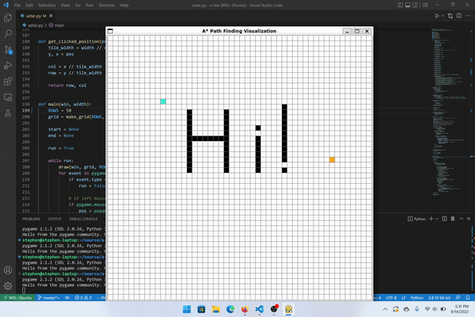

# A* Pathfinding Visualizer

### A* Search/Pathfinding Algorithm

A* is a pathfinding algorithm that can find the shortest path between two nodes (vertices) on a graph in an efficient manner.

It is a *combination* of 2 algorithms: **Djikstra's Algorithm** and **Greedy Best-First-Search**.

A* is an efficient algorithm because it combines the information that
Djikstra's Algorithm uses (favoring vertices closest to the starting vertex) _and_ the information that Greedy Best-First-Search uses (favoring vertices closest to the ending vertex with a heuristic) to search for the shortest path. 

At each step, A* determines which of its path to extend by selecting the path that minimizes:

$ f(n) = g(n) + h(n)$

where $n$ is a particular node on the graph, $g(n)$ is the total cost/distance
of the path from the start node to $n$, and $h(n)$ is a *heuristic*
that estimates how far away $n$ is from the end node.

### Visualization

